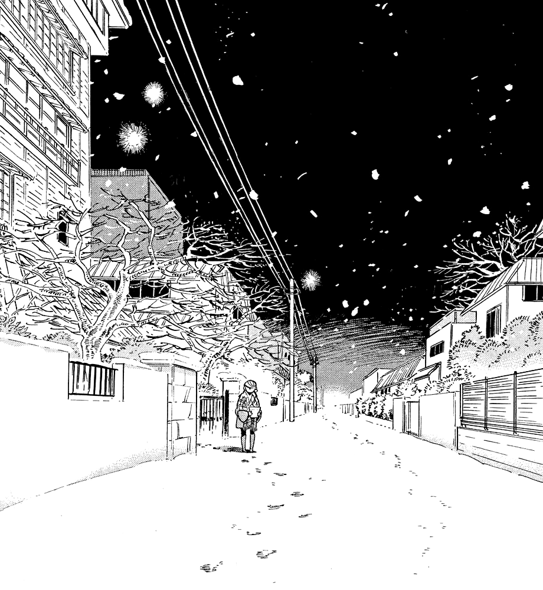
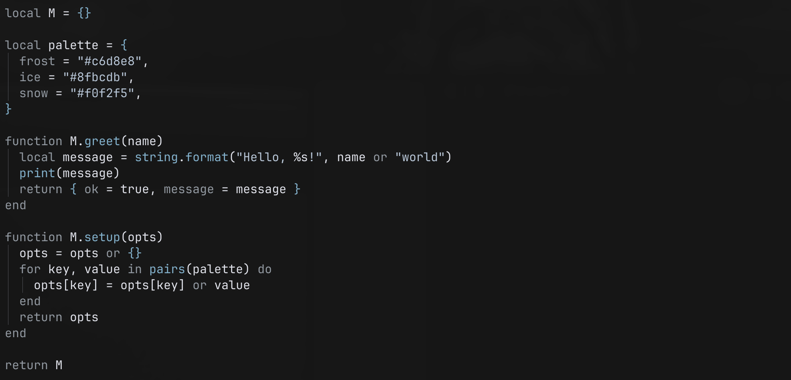
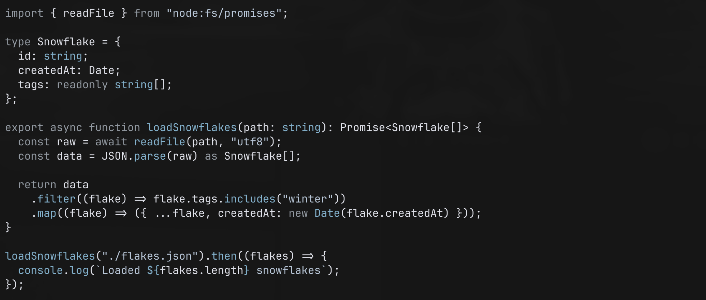

# yuki.nvim



A Neovim lua theme built with [Lush](https://github.com/rktjmp/lush.nvim).

Yuki (雪) means snow — a cold, minimal colorscheme.

`yuki.nvim` is a quiet, chill, monochrome-leaning palette inspired by snowy streets in the night. Easy on the eyes but not overwhelming.

<br clear="right" />

# Installation

## lazy.nvim
```lua
{ "wu-json/yuki.nvim" },
{
  "LazyVim/LazyVim",
  opts = { colorscheme = "yuki" },
}
```

## vim-plug
```vim
Plug 'wu-json/yuki.nvim'
```

## packer.nvim
```lua
use 'wu-json/yuki.nvim'
```

## Manual Installation
```bash
git clone https://github.com/wu-json/yuki.nvim.git ~/.config/nvim/pack/colors/start/yuki.nvim
```

Then add to your vim config:
```vim
colorscheme yuki
```

# Showcase

## Lua



## TypeScript



# Development

`yuki.nvim` is built with [Lush](https://github.com/rktjmp/lush.nvim) and uses [Shipwright](https://github.com/rktjmp/shipwright.nvim) as the build-system to output the color scheme. In development, you can point to the lush theme to get live feedback on color adjustments via `yuki_lush`.

To build the final color scheme, run `:Shipwright`.

```bash
nvim -c "Shipwright" -c "quit"
```
